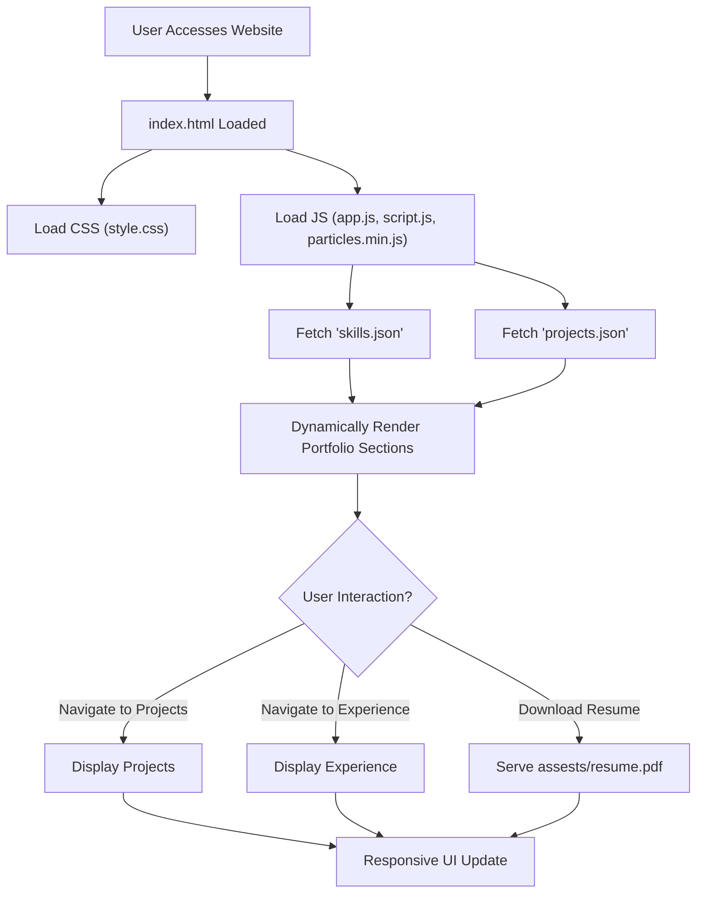

# 🚀 Dynamic Developer Portfolio

<p align="center"></p>

## Short Description

Elevate your professional presence with the **Dynamic Developer Portfolio**, a modern, interactive, and fully responsive website designed to showcase your skills, projects, and experience with unparalleled clarity and impact. Built on a robust foundation of HTML5, CSS3, and JavaScript, this portfolio is engineered to captivate recruiters and collaborators alike, providing an engaging user experience that puts your achievements front and center. Featuring dynamic content loading and a seamless CI/CD pipeline, it's not just a website—it's your personalized digital stage.

## ✨ Key Features

*   **Striking & Interactive UI:** Immerse visitors with a visually rich and interactive design, featuring dynamic backgrounds powered by Particles.js for an engaging first impression.
*   **Comprehensive Profile Showcase:** Dedicated sections for your professional experience, diverse projects, and a detailed breakdown of your technical skills, all dynamically loaded for easy updates.
*   **Seamless Navigation:** Intuitive and responsive design ensures a flawless experience across all devices, from desktops to mobile phones.
*   **Automated Deployment (CI/CD):** Leverages GitHub Actions for a streamlined Continuous Integration and Continuous Deployment pipeline, ensuring your latest achievements are always live with minimal effort.
*   **Downloadable Resume:** Provides a convenient, direct link to download your resume (`assests/resume.pdf`), making it effortless for potential employers to access your full credentials.
*   **Error Handling:** Includes a custom `404.html` page for a polished user experience even on broken links.
*   **Modular & Maintainable Codebase:** Cleanly structured HTML, CSS, and JavaScript, with content managed via JSON files (`projects.json`, `skills.json`), making updates and expansions straightforward.

## Who is this for?

This portfolio is ideal for **software developers, web designers, and tech professionals** seeking a polished, dynamic, and easily maintainable platform to:

*   **Attract Recruiters:** Clearly demonstrate your capabilities and project work to potential employers.
*   **Showcase Expertise:** Present your technical skills and experience in an organized and visually appealing manner.
*   **Network & Collaborate:** Provide a central hub for your professional identity, making it easy for others to connect with your work.
*   **Personal Branding:** Establish a strong online presence that reflects your professionalism and technical prowess.

## Technology Stack & Architecture

The Dynamic Developer Portfolio is a testament to modern front-end development, focusing on performance, maintainability, and user experience.

*   **Frontend:** HTML5, CSS3, JavaScript (Vanilla JS, with the integration of **Particles.js** for interactive visual effects).
*   **Content Management:** Project and skill data are elegantly managed through local **JSON files**, allowing for quick and easy content updates without touching the core code.
*   **Development Tools:** Utilizes **VS Code** for an optimized development environment.
*   **DevOps:** Implements **GitHub Actions** for robust Continuous Integration and Continuous Deployment, ensuring automated builds and deployments on every push to the main branch.
*   **Hosting:** Designed for static site hosting, offering high performance and scalability.

## 📊 Architecture & Database Schema

As a static, client-side rendered portfolio, the architecture focuses on efficient content delivery and dynamic presentation via JavaScript. There is no traditional database schema; data is served via local JSON files.



## ⚡ Quick Start Guide

Getting your personalized portfolio up and running is straightforward:

1.  **Clone the Repository:**
    ```bash
    git clone https://github.com/shravanishete06/portfolio_website.git
    cd portfolio_website
    ```
2.  **Open in Browser:** Simply open `index.html` in your preferred web browser.
    Alternatively, for local development with a live server:
    ```bash
    # If you have Node.js installed, you can use http-server
    npm install -g http-server
    http-server .
    ```
    Then, navigate to `http://localhost:8080` (or the port indicated by `http-server`).
3.  **Customize Your Content:**
    *   Update `projects/projects.json` with your project details.
    *   Modify `skills.json` to reflect your technical proficiencies.
    *   Replace `assests/resume.pdf` with your own resume.
    *   Personalize images in `assests/images/` and text in `index.html`, `experience/index.html`, and `projects/index.html`.

## 📜 License

This project is licensed under the MIT License. See the `LICENSE` file for full details.